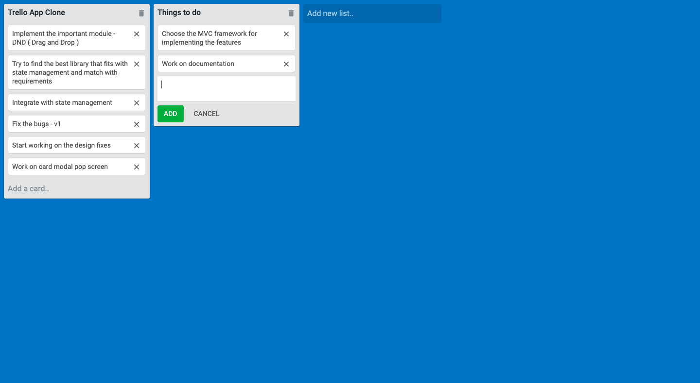
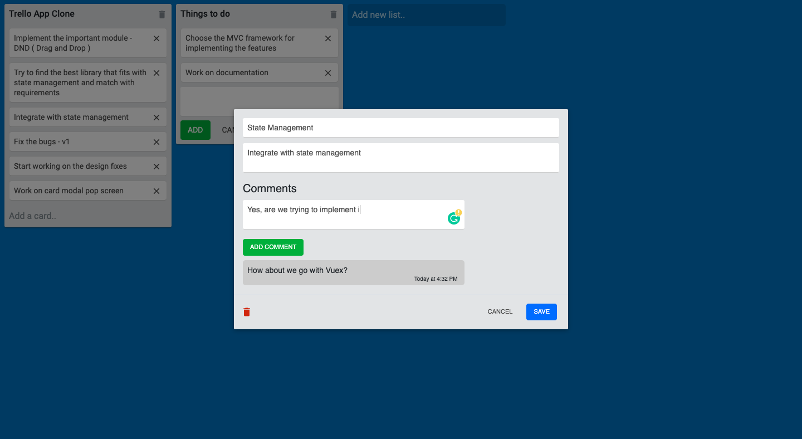
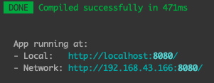

### Trello clone app - [Demo](https://keen-lichterman-1dce1c.netlify.app/)
It's a task management app for SME companies. It help to organize and move create there own priorites list and following tasks. Depends on the status of the tasks, the task can be moved from one list to the another by simply drag and drop. If need to include any sets of process in between a list. It can be done by dragging to its respective positions.

Below is the two screanshots of v1 of trello clone app




#### File and Folder structure of the app
```
.
├── App.vue
├── assets
│   ├── card-pop-up.png
│   ├── logo.png
│   └── trello-overview.png
├── components
│   ├── Board.vue
│   ├── Card.vue
│   ├── CardEditModal.vue
│   ├── Cards.vue
│   ├── List.vue
│   └── Lists.vue
├── main.js
├── store.js
└── utils.js
```

#### Run in local environment
To run the app in a local environment you have some prerequisites installation need. Follow the below steps to get the app running. 

If you don't have ``vue-cli`` installed in your system, follow [link](https://cli.vuejs.org/guide/installation.html) to install.

Clone the [project](https://github.com/karthikricssion/simple-trello-app.git). Navigate into the folder and then run the below code to install all the libraries and setup.

```
npm install
```

Once the installation is done, run the below code to run the app in development mode
````
npm run serve
````
This takes a few minutes of time to compile the code and gives a successfull message and the port number as shown below
 \
Now go to the browser and type the URL to check out the app.


